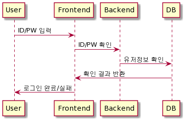
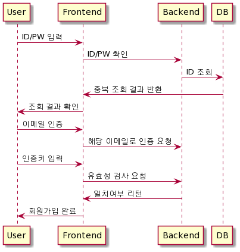
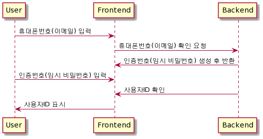
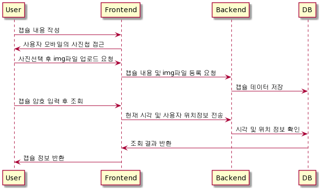
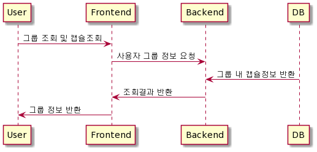

> Team 5
>
> Team name: 캐터피🐛

# Time Letter 📮

## | 타임레터 :: 당신의 추억을 간직해드립니다. 미래의 당신과 소통하는 길. 타임레터⏱


> [메인 Page](Readme.assets/메인.gif)

> [레터 생성 페이지](Readme.assets/레터생성.gif)

> [조회 페이지](Readme.assets/레터조회.gif)

> [그룹 페이지](Readme.assets/그룹.gif) 

> [마이 페이지](Readme.assets/마이페이지.gif)

------

## 🔍 What's TimeLetter

> Time Capsule과 Letter의 합성어

```
소중한 추억을 담아 미래로 보내는 비동시성 메시징 서비스
```


## 🏓 Features

1. 레터 생성기능
   * 영상 업로드
     * 휴대폰에서 촬영한 영상 및 앨범에 저장된 영상 업로드
   * 오픈 조건 설정
     * 오픈할 날짜 지정
   * 추억의 장소 저장
     * kakao map을 통해 기억하고 싶은 장소 저장
2. 레터 조회
   * 레터 생성 시 레터 식별자로 사용되는 고유 토큰을 발급
   * 오픈/비오픈 레터를 구별하여 본인에게 생성된 레터 제공

3. 그룹 기능
   * 멤버 추가
     * 이름으로 멤버 검색
4. 알림 기능
   * 서버에서 분 단위로 레터 확인 후 알림 전송
   * 사이트 내부 알림
     * 알림 버튼으로 조회
   * 문자 메시지
     * 오픈 날짜에 문자 메시지 발송
5. 모바일 호환
   * ios, andriod, windows 간의 호환 가능

- [**알림 기능**]

## 🌏 Browser Support

|  Chrome |  Internet Explorer |  Edge |  Safari |  Firefox |
| :----------------------------------------------------------: | :----------------------------------------------------------: | :----------------------------------------------------------: | :----------------------------------------------------------: | :----------------------------------------------------------: |
|                             Yes                              |                             10+                              |                             Yes                              |                             Yes                              |                             Yes                              |

##  📂Tech Stack

### Tools

| Tool          | 기술                                                 |
| ------------- | ---------------------------------------------------- |
| GitLab        | 기능별 branch를 나눠서 코드 버전 관리                |
| Jira          | Issue 관리를 위해 Git과 연동하여 사용                |
| Scrum Poker   | Jira Issue 별 스프린트 시간 관리를 위한 어플리케이션 |
| VS Code       | code 구현을 위한 Tool                                |
| Google Chrome | 구현한 화면을 출력하기 위한 브라우저                 |

### ◾ Library

| Library | 내용                                      |
| ------- | ----------------------------------------- |
| Spring  | Backend 구현을 위한 Java web framework    |
| React   | Frontend 구현을 위한 JavaScript framework |

### ◾ Software Language

| Language   | 기술               |
| ---------- | ------------------ |
| Java       | Backend 구현 언어  |
| JavaScript | Frontend 구현 언어 |
| HTML/CSS   | Frontend 구현 언어 |


## 🔧 Architecture

**Entitiy Relationship Diagram**


**Sequence Diagrams**

- 로그인




- 회원가입




- ID/PW 찾기




- 캡슐생성 및 조회




- 그룹관리



## 📦 Packages (M)

###  Frontend

| Name                        | Description                                                  |
| --------------------------- | ------------------------------------------------------------ |
| "@material-ui/core"         | React components  for faster and simpler web development. Build your own design system, or  start with Material Design |
| "@material-ui/icons"        | This package provides the Google Material  icons packaged as a set of React components. |
| "@material-ui/lab"          | This package hosts the incubator  components that are not yet ready to move to core. |
| "@reduxjs/toolkit"          | This package hosts the incubator  components that are not yet ready to move to core. |
| "@testing-library/jest-dom" | Custom jest matchers to test the  state of the DOM           |
| "@testing-library/react"    | Simple and complete React DOM  testing utilities that encourage good testing practices. |
| "antd"                      | An enterprise-class UI design  language and React UI library. |
| "axios"                     | Promise based HTTP client for  the browser and node.js       |
| "gsap"                      | GSAP is a robust JavaScript  toolset that turns developers into animation superheroes |
| "howler"                    | howler.js is an audio library  for the modern web            |
| "moment"                    | A JavaScript date library for  parsing, validating, manipulating, and formatting dates. |
| "node-sass"                 | Node-sass is a library that  provides binding for Node.js to LibSass, the C version of the popular  stylesheet preprocessor, Sass. |
| "react-device-detect"       | Detect device, and render view  according to the detected device type. |
| "react-dom"                 | This package serves as the entry  point to the DOM and server renderers for React |
| "react-scripts"             | This package includes scripts  and configuration used by Create React App.     Please refer to its documentation: |
| "react-howler"              | A React.js wrapper for howler.js  (audio player).            |
| "sweetalert"                | A beautiful replacement for  JavaScript's "alert"            |


### Backend

| Name           | Description                                                  |
| -------------- | ------------------------------------------------------------ |
| [`$mysql`]()   | MySQL connector                                              |
| [`$lombok`]()  | getter, setter, toString 등의 메서드 작성 코드를 줄여주는 코드 다이어트 라이브러리 |
| [`$jjwt`]()    | JWT 토큰 생성 및 JWT 토큰 파싱, 검증을 해주는 라이브러리     |
| [`$json`]()    | JavaScript Object Notation; 경량(Lightweight)의 DATA-교환 형식 |
| [`$jackson`]() | JSON Convertor(컨트롤러에서 전달한 DTO데이터를 JSON으로 변경하기 위해 사 |
| [`$swagger`]() | REST 웹 서비스를 설계, 빌드, 문서화, 소비하는 일을 도와주는 대형 도구 생태계의 지원을 받는 오픈 소스 소프트웨어 |


## 📚 준비하기

> DB 생성하고 설정 파일 application.properties(백엔드), .env(프론트엔드) 파일 생성 및 추가하시면 됩니다

1. Git clone 받기

```
git clone https://lab.ssafy.com/s04-bigdata-sub3/s04p23d106.git
```

2. 데이터베이스 준비

- 'timeletter' 테이터베이스 생성

```
CREATE SCHEMA `timeletter`;
```

-  필요한 테이블 생성

[Database Tables](.docs/DBTable.sql)

3. [**Backend**] application.properties 설정

- backend\src\main\resources 폴더 아래 생성하시면 됩니다
- mysql 도메인과 아이디/비번 작성

```
server:
	servlet:
		context-path: /timeletter

# fileupload 
spring:
	servlet:
		multipart:
			enabled:true
			max-file-size:500MB
			max-request-size:500MB
	datasource:
        driver-class-name: com.mysql.cj.jdbc.Driver
        url: jdbc:mysql://k4d105.p.ssafy.io/timeletter?serverTimeZone=UTC&CharacterEncoding=UTF-8
        username: caterpie
        password: password
	jpa:
        hibernate:
        	ddl-auto: none
        show-sql: false
        properties:
        	hibernate:
        		format_sql: true        
       
# jwt
jwt:
  header: Authorization
  secret: dGltZWxldHRlci1pcy1hLXNsb3ctbWVzc2FuZ2VyLXBsYXRmb3JtLXNlcnZpY2VkLWJ5LXRlYW0tY2F0ZXJwaWUtc2luY2UtMjAyMS1hbGwtcmlnaHRzLXJlc2VydmVkLWF0LWNhdGVycGllCg==
  token-validity-in-seconds: 86400

# logging
logging:
  level:
    com.caterpie: DEBUG
```

4. [Frontend] .env 작성

- frontend 폴더 아래 생성하시면 됩니다
- nginx에 명시된 location을 따라갑니다

```
React_APP_SERVER_URL={도메인주소}
React_APP_SPRING_URL={도메인주소}/timeletter
React_APP_STORAGE_URL={도메인주소}/videos
```

5. [Frontend] 모듈 다운로드

```
# frontend 폴더로 이동해서 다운
cd frontend/
npm install
```

6. [Backend] (Option) Spring boot를 build(jar 파일 생성)

```
# backend 폴더로 이동해서 Spring boot jar 파일 생성
cd backend/build/libs
./gradlew bootJar
```

<br />


## 🏁 실행하기

1. 백엔드 실행

- 생성한 jar 파일 실행

```
java -jar [filename].jar //timeletter.jar
```

- 혹은 war 파일 생성하지 않고 demon으로 로컬에서 실행하고 싶다면 STS와 같은 IDEA에서 Spring boot Run을 실행하거나 아래 명령어를 통해 실행

```
mvn spring-boot:run
```

2. 프론트엔드 실행

* 패키지 설치

```
$ npm i
```

* React 실행

```
npm start
```

<br/>


## 🖥 배포하기

해당 서비스는 AWS EC2를 통해 배포하였고
Docker와 Jenkins를 이용해 CI/CD 구축하였습니다:

1. AWS EC2 인스턴스 생성 (ubuntu)
2. docker 설치
3. 필요한 이미지를 docker hub를 통해 설치
   1. Jenkins
   2. MySQL
4. docker-compose.yml 작성(services - `jenkins`, `db`, `frontend`  network: `caterpie`)
5. Jenkins와 Gitlab repository 연동
6. MySQL 컨테이너에 `timeletter` DB 스키마 생성
7. Nginx 설정 (frontend/nginx 폴더의 default.conf)
8. frontend, backend 폴더 안에 dockerfile 작성
9. 프로젝트 root 위치에 Jenkins 파일 작성
   1. Build and Test 과정
   2. Build (frontend, backend)
   3. Run (컨테이너 실행)
10. `docker ps` 를 통해 frontend, backend, django 컨테이너가 실행되는 것을 확인 (Jenkins, MySQL 포함)

<br/>


## 💬 Documents

* [Caterpie 노션](https://www.notion.so/26c90b874578426d949367042e455a72)
* [계획서](./산출물/프로젝트 계획서 양식.pdf)
* [와이어프레임](./산출물/타임캡슐 Wireframe.pdf)
* [기능명세서](./산출물/자율프로젝트_기능명세서.pdf)
* [테스트 케이스](./산출물/화면별 테스트 케이스 및 조치사항.pdf)
* [발표자료 - 기획](./산출물/D105_기획발표.pdf)
* [발표자료 - 최종](./산출물/D105_최종발표.pdf)


## 👥 Contributer

- 안세익(FE)
- 이대헌(FE)
- 이혜진(FE)
- 장민호(BE)
- 조현섭(BE)

## 🚀 References

- [Markdownify - README.md](https://github.com/amitmerchant1990/electron-markdownify#related)
- [TOAST UI Editor - README.md](https://github.com/nhn/tui.editor#readme)


## 📜 License

This software is licensed under the [MIT](.docs/LICENSE) © [SSAFY](https://www.ssafy.com/ksp/jsp/swp/swpMain.jsp).

